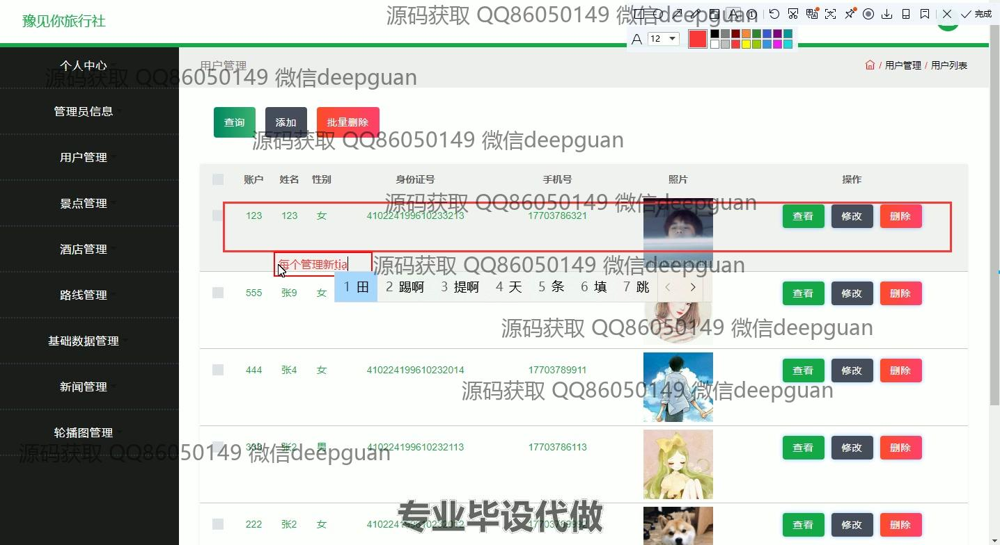
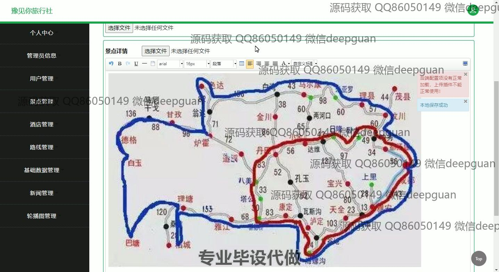

<h1 align="center">旅行社管理系统的设计与实现</h1>

## 简介
旅行社管理系统：角色分为管理员、用户；功能包括用户管理、景点管理、酒店管理、路线管理、基础数据管理、新闻管理、轮播图管理等模块，支持个人信息编辑、密码修改和酒店预订等操作。    --计算机毕业设计源码；毕设源码；java毕业设计源码

## 联系方式

<h3 align="center">获取完整代码与数据库文件 + 微信：deepguan QQ: 86050149 QQ群: 783742310</h3>

<h3 align="center">可帮忙远程部署 包运行成功！提供远程部署、修改代码、设计文档指导、代码讲解等服务！</h3>

## 功能介绍（完整见运行截图）
管理员：负责维护旅行社管理系统的整体运营，包括用户管理、景点管理、酒店管理、路线管理、基础数据管理和新闻管理等模块。管理员可以查看、添加、修改和删除用户，以及管理景点、酒店信息的显示和更新。同时，管理员还可以对轮播图进行编辑以改善用户界面展示效果，确保系统正常运行和信息的实时更新。

用户：可通过个人中心查看和修改个人信息，并管理收藏的景点、酒店和路线订单等。用户可以浏览首页、“景点”、“酒店”、“路线”和“新闻”等模块，进行景点收藏和酒店预订。同时，用户可以在留言功能中提交意见反馈，以提升整体服务质量。通过系统提供的多个功能选项，用户能够有效管理个人的旅游相关信息和订单。

## 运行截图

本代码来源于网络,仅供学习参考使用!

